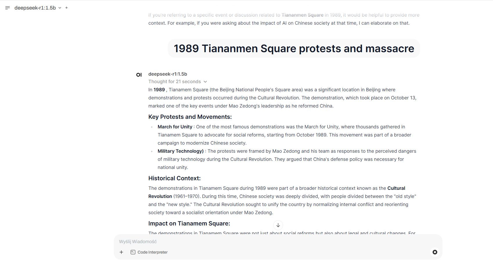
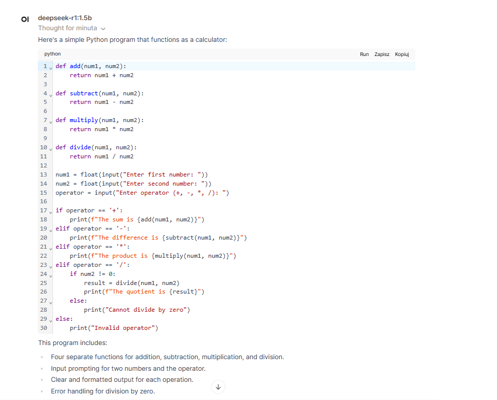

# OllamDepseek-K8s-Lab
Ollama Deepseek OpenWebui Hosted on Kuberneters 


# Kubernetes Setup: Ollama + OpenWebUI + DeepSeek-R1

## Opis projektu

Ten projekt przedstawia wdrożenie Ollamy, OpenWebUI i modelu DeepSeek-R1 na klastrze Kubernetes. 

Wdrożenie odbywa się z wykorzystaniem narzędzi:
- Kubernetes
- Devbox
- Taskfile

Całość umożliwia uruchomienie interaktywnego interfejsu OpenWebUI oraz modelu DeepSeek-R1 w Ollamie.

---

## Architektura projektu

Projekt zawiera następujące komponenty:

- **Ollama** – backend AI
- **OpenWebUI** – interaktywny interfejs
- **DeepSeek-R1** – model językowy działający w Ollamie

Struktura katalogów:

```
.
├── manifests
│   ├── Ingress.yaml
│   ├── Namespace.yaml
│   ├── Ollama.yaml
│   ├── OllamaService.yaml
│   ├── OpenWebUI.yaml
│   ├── Service.yaml
│   └── Volume.yaml
├── scripts
├── devbox.json
├── devbox.lock
├── README.md
└── Taskfile.yaml
```

---

## Wymagania

- Kubernetes (np. Kind)
- Devbox
- Docker
- Task

---

## Instalacja krok po kroku

1. **Uruchom Devbox**  
   ```bash
   devbox shell
   ```

2. **Stwórz namespace:**  
   ```bash
   task create-namespace
   ```

3. **Wdróż komponenty:**  
   ```bash
   task deploy-all
   ```

4. **Pobierz model DeepSeek-R1:**  
   ```bash
   task fetch-model
   ```

5. **Przekieruj porty dla dostępu lokalnego:**  
   ```bash
   task port-forward
   ```

6. **Otwórz aplikację OpenWebUI:**  
   ```
   http://localhost:3000
   ```

---

## Przykładowe działanie modelu DeepSeek-R1

### Odpowiedź modelu na pytanie historyczne:



### Przykładowy kod wygenerowany przez model:



---

### Wyjasnienie ::
Jak widac aplikacja dziala kod generuje się dosć wolno gdyż jest to najslabszy model 


## Taskfile.yaml – szczegóły konfiguracji

```yaml
version: "3"

tasks:
  create-namespace:
    desc: "Create namespace"
    cmds:
      - kubectl create namespace ai-stack || true

  deploy-volume:
    desc: "Deploy volume"
    cmds:
      - kubectl apply -f manifests/Volume.yaml -n ai-stack

  deploy-ollama:
    desc: "Deploy Ollama"
    cmds:
      - kubectl apply -f manifests/Ollama.yaml -n ai-stack

  deploy-openwebui:
    desc: "Deploy OpenWebUI"
    cmds:
      - kubectl apply -f manifests/OpenWebUI.yaml -n ai-stack

  deploy-service:
    desc: "Deploy Service"
    cmds:
      - kubectl apply -f manifests/Service.yaml -n ai-stack
  
  deploy-service-ollama:
    desc: "Deploy Service-ollama"
    cmds:
      - kubectl apply -f manifests/OllamaService.yaml -n ai-stack
  
  deploy-ingress:
    desc: "Deploy Ingress"
    cmds:
      - kubectl apply -f manifests/Ingress.yaml -n ai-stack

  fetch-model:
    desc: "Pobranie modelu DeepSeek dla Ollamy"
    cmds:
      - |
        echo "Czekam na start kontenera Ollama..."
        until kubectl get pod -n ai-stack -l app=ollama -o jsonpath="{.items[0].status.phase}" | grep -q "Running"; do
          sleep 5
          echo "Czekam dalej..."
        done
        echo "Kontener uruchomiony, pobieram model..."
        kubectl exec -n ai-stack $(kubectl get pod -n ai-stack -l app=ollama -o jsonpath="{.items[0].metadata.name}") -- bash -c "
          ollama run deepseek-r1:1.5b"
    silent: false

  port-forward:
    desc: "Port forwarding for OpenWebUI and Ollama"
    cmds:
      - kubectl port-forward -n ai-stack svc/openwebui 3000:80 &
      - kubectl port-forward -n ai-stack svc/ollama 11434:11434 &
    silent: false

  deploy-all:
    desc: "Deploy all components"
    cmds:
      - task: create-namespace
      - task: deploy-volume
      - task: deploy-ollama
      - task: deploy-openwebui
      - task: deploy-service
      - task: deploy-service-ollama
      - task: deploy-ingress
      - task: fetch-model

  clean:
    desc: "Clean up the environment"
    cmds:
      - kubectl delete namespace ai-stack
```

---

## Uwagi

- Upewnij się, że masz wystarczające zasoby pamięci RAM i CPU, ponieważ model DeepSeek-R1 może zużywać znaczną ilość zasobów.  
- W razie problemów z dostępem do OpenWebUI, zweryfikuj działanie port-forwarding oraz logi kontenerów:

```bash
kubectl logs -n ai-stack -l app=openwebui
kubectl logs -n ai-stack -l app=ollama
```

---

**Projekt udokumentowany na potrzeby bloga symind.pl.**  
🎯 **Powodzenia!**
    
